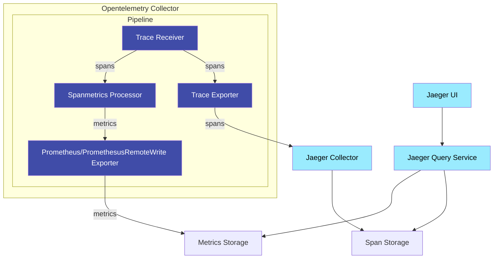

# Aggregated Trace Metrics (ATM)

The motivation for this feature is to help identify interesting traces (e.g. high
QPS, slow or erroneous requests) without knowing the service or operations up-front.

This is essentially achieved through aggregating span data to produce R.E.D
(Request, Error, Duration) metrics.

As such, technically speaking, the term "Trace" used in the ATM acronym is a
slight misnomer, while the term "Span" would be more appropriate because these
metrics are trace unaware.

Potential use cases include:

- Post deployment sanity checks across the org, or on known dependent services
  in the request chain.
- Monitoring and root-causing when alerted of an issue.
- Better onboarding experience for new users of Jaeger UI.
- Long-term trend analysis of QPS, errors and latencies.
- Capacity planning.


Prometheus compatible backends:
https://promlabs.com/blog/2020/11/26/an-update-on-promql-compatibility-across-vendors

## Getting Started

A locally runnable setup is available in: https://github.com/jaegertracing/jaeger/tree/main/docker-compose/monitor.

This is for demonstration purposes only and does not reflect deployment best practices.

## Architecture




## Configuration

### Enabling ATM

The following configuration is required to enable the ATM feature:

- Jaeger UI: [Frontend/UI Configuration][frontend-ui.md]
- Jaeger Query:
  - Set the `METRICS_STORAGE_TYPE` environment variable to `prometheus`.
  - Optional: Set `--prometheus.server-url` (or `PROMETHEUS_SERVER_URL` environment variable)
    to the URL of the prometheus server. Default: http://localhost:9090.

### Enabling ATM

## API

Used by the Monitor tab of Jaeger UI to populate the metrics for its visualizations.

### gRPC/Protobuf

The recommended way to programmatically retrieve traces and other data is via `jaeger.api_v2.metrics.MetricsQueryService` gRPC endpoint defined in the [metricsquery.proto][metricsquery.proto] IDL file.

### HTTP JSON

#### R.E.D. Metrics Queries

`/api/metrics/{metric_type}?{query}`

Where (in Backus-Naur form):
```
metric_type = 'latencies' | 'calls' | 'errors'

query = services , [ '&' optionalParams ]

optionalParams = param | param '&' optionalParams

param =  groupByOperation | quantile | endTs | lookback | step | ratePer | spanKinds

services = service | service '&' services
service = 'service=' strValue
  - The list of services to include in the metrics selection filter, which are logically 'OR'ed.
  - Mandatory.

quantile = 'quantile=' floatValue
  - The quantile to compute the latency 'P' value. Valid range (0,1].
  - Mandatory for 'latencies' type.

groupByOperation = 'groupByOperation=' boolValue
boolValue = '1' | 't' | 'T' | 'true' | 'TRUE' | 'True' | 0 | 'f' | 'F' | 'false' | 'FALSE' | 'False'
  - A boolean value which will determine if the metrics query will also group by operation.
  - Optional with default: false

endTs = 'endTs=' intValue
  - The posix milliseconds timestamp of the end time range of the metrics query.
  - Optional with default: now

lookback = 'lookback=' intValue
  - The duration, in milliseconds, from endTs to look back on for metrics data points.
  - For example, if set to `3600000` (1 hour), the query would span from `endTs - 1 hour` to `endTs`.
  - Optional with default: 3600000 (1 hour).

step = 'step=' intValue
  - The duration, in milliseconds, between data points of the query results.
  - For example, if set to 5s, the results would produce a data point every 5 seconds from the `endTs - lookback` to `endTs`.
  - Optional with default: 5000 (5 seconds).

ratePer = 'ratePer=' intValue
  - The duration, in milliseconds, in which the per-second rate of change is calculated for a cumulative counter metric.
  - Optional with default: 600000 (10 minutes).

spanKinds = spanKind | spanKind '&' spanKinds
spanKind = 'spanKind=' spanKindType
spanKindType = 'unspecified' | 'internal' | 'server' | 'client' | 'producer' | 'consumer'
  - The list of spanKinds to include in the metrics selection filter, which are logically 'OR'ed.
  - Optional with default: 'server'
```

##### Responses

The response data model is based on [`MetricsFamily`](https://github.com/jaegertracing/jaeger/blob/main/model/proto/metrics/openmetrics.proto#L53).

For example:
```
{
  "name": "service_call_rate",
  "type": "GAUGE",
  "help": "calls/sec, grouped by service",
  "metrics": [
    {
      "labels": [
        {
          "name": "service_name",
          "value": "driver"
        }
      ],
      "metricPoints": [
        {
          "gaugeValue": {
            "doubleValue": 0.005846808321083344
          },
          "timestamp": "2021-06-03T09:12:06Z"
        },
        {
          "gaugeValue": {
            "doubleValue": 0.006960443672323934
          },
          "timestamp": "2021-06-03T09:12:11Z"
        },
...
  ```

If the `groupByOperation=true` parameter is set, the response will include the operation name in the labels like so:
```
      "labels": [
        {
          "name": "operation",
          "value": "/FindNearest"
        },
        {
          "name": "service_name",
          "value": "driver"
        }
      ],
```

#### Min Step Query

`/api/metrics/minstep`

Gets the min time resolution supported by the backing metrics store, in milliseconds, that can be used in the `step` parameter.
e.g. a min step of 1 means the backend can only return data points that are at least 1ms apart, not closer.


[metricsquery.proto]: https://github.com/jaegertracing/jaeger/blob/main/model/proto/metrics/metricsquery.proto
